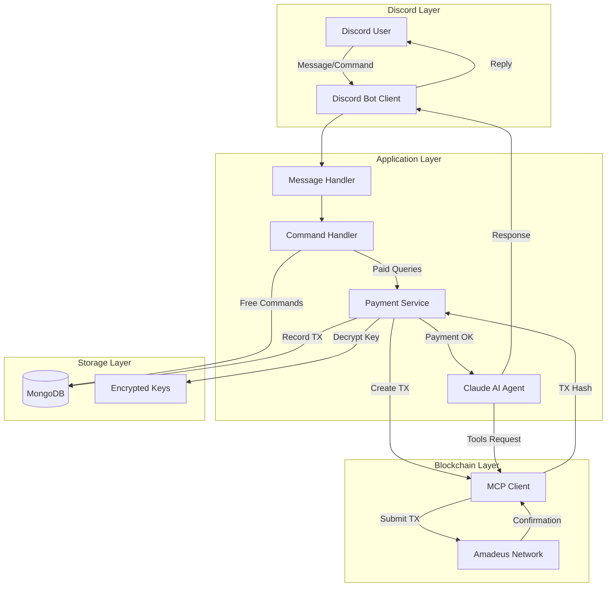

# Cisco Discord Bot 

<div align="center">
  
</div>

Cisco is an AI-powered Discord bot with Amadeus blockchain integration that allows users to query the blockchain - retrieve balances, make transactions and so much more - using natural language instead of high level requests on the blockchain.

### **[Try Cisco on Discord](https://discord.com/oauth2/authorize?client_id=1460026359752429813&permissions=277025646656&integration_type=0&scope=bot+applications.commands)**

**[Watch On Youtube](https://youtube.com/shorts/vFpTxsLlvso)**
---

## 🎯 Concept

### Problem Statement

Discord communities struggle to integrate AI agents with real time access to blockchain data due to high API costs with traditional providers, lack of built-in payment mechanisms for AI services, absence of decentralized payment infrastructure, and privacy concerns with centralized payment systems. Traditional solutions require complex payment gateways, expose user financial data, and don't provide transparent, per-use pricing models that align with actual usage.

### Solution

Cisco is a Discord bot that seamlessly integrates Claude AI with Amadeus blockchain payments, enabling a true pay-per-request model where users pay with AMA for each query they make to the blockchain (simialr feature to the x402 payment system). The bot provides encrypted private key storage, direct blockchain payments with no intermediaries, and transparent transaction tracking, making AI-as-a-service accessible and accountable within Discord communities.

### Use Cases

1. **Community Knowledge Base**: Server members ask questions about server rules, events, or topics, paying small amounts (in AMA) per query without subscriptions
2. **Blockchain Queries**: Users query the AI agent about blockchain transactions, wallet balances, network statistics, and on-chain data
3. **AI-Powered Transfers**: Natural language commands to send tokens ("send 10 AMA to Alice") with automated transaction signing
4. **Developer Testing**: Test Amadeus payment flows and MCP integration in a familiar Discord environment
5. **Educational Platform**: Students pay per question in educational Discord servers, ensuring fair access without upfront costs

---

## Features

- 🤖 **AI Assistant** - Claude-powered responses with Amadeus blockchain tools
- 💰 **Auto-Generated Wallets** - Each user gets a personal Amadeus wallet
- 🔒 **Encrypted Storage** - Private keys encrypted with AES-256-GCM
- 💸 **Pay-Per-Request** - Automatic 1 AMA charge per query
- 📊 **Usage Tracking** - Transaction history and statistics
- 🔧 **MCP Integration** - Direct blockchain access via Model Context Protocol

---

## 🏗️ Architecture

### System Components



### Data Flow

1. **User Message** → Discord Bot receives message or command
2. **Authentication** → Get or create user in MongoDB with Amadeus wallet
3. **Command Routing** → Check if free command (balance, deposit, stats) or paid query
4. **Payment Processing** → For paid queries:
   - Pre-flight balance check
   - Create transaction via MCP
   - Decrypt private key from MongoDB
   - Sign transaction with BLS12-381
   - Submit to Amadeus blockchain
   - Record transaction hash
5. **AI Processing** → Send query to Claude with MCP tools access
6. **Response** → Return AI response to Discord user
7. **Audit Trail** → Store transaction and usage statistics in MongoDB

### Agent Roles

**Claude AI Agent**: Acts as the intelligent query processor with access to 19+ Amadeus blockchain tools via MCP. The agent can:
- Understand natural language requests
- Decide which blockchain tools to use
- Execute multi-step operations (e.g., check balance, then transfer)
- Provide conversational responses with transaction confirmations
- Handle errors gracefully and explain blockchain operations to users

---

## 🔗 How Amadeus Is Used

### Current Implementation

#### 1. **Amadeus SDK Integration**
We leverage the `@amadeus-protocol/sdk` (v1.0.2) for:
- **BLS12-381 Key Generation**: Each Discord user gets a unique Amadeus wallet using the SDK's cryptographic primitives
- **Transaction Building**: Create properly formatted transactions compatible with Amadeus network
- **Atomic Unit Conversion**: `toAtomicAma()` for precise payment amounts

#### 2. **MCP (Model Context Protocol) Server**
We connect to the official Amadeus MCP server (`mcp.ama.one`) to access blockchain functionality:

**Core Tools Used**:
- `create_transaction` - Build unsigned transactions for payments
- `submit_transaction` - Submit signed transactions to the network
- `get_account_balance` - Query real-time wallet balances
- `get_transaction` - Verify transaction status and details
- `get_transaction_history` - Fetch user transaction history
- `get_chain_stats` - Network statistics and health
- `claim_testnet_ama` - Testnet faucet for development

**Custom Tools Built**:
- `transfer_ama` - Automated end-to-end transfer (create + sign + submit)
- `get_user_info` - Combined user wallet and stats lookup
- `get_user_balance` - Real-time balance with database caching
- `get_user_stats` - User usage analytics and history

#### 3. **Wallet Management & Security**
- **Key Generation**: `generateAmadeusWallet()` creates BLS12-381 key pairs
- **Encryption**: Private keys encrypted with AES-256-GCM before MongoDB storage
- **Signing**: `signTransaction()` uses BLS12-381 signatures for transaction authorization
- **Auto-Creation**: Wallets generated on first user interaction, no manual setup

#### 4. **Payment Processing Flow**
```typescript
// 1. Pre-flight balance check
const balance = await getAmadeusBalance(user.amadeusPublicKey);

// 2. Create transaction via MCP
const txData = await mcpClient.request({
  method: 'tools/call',
  params: {
    name: 'create_transaction',
    arguments: {
      signer: user.amadeusPublicKey,
      contract: 'Coin',
      function: 'transfer',
      args: [{ b58: SYSTEM_WALLET }, PAYMENT_ATOMIC, 'AMA']
    }
  }
});

// 3. Sign with user's private key
const signature = signTransaction(signing_payload, decryptedPrivateKey);

// 4. Submit to blockchain
const result = await mcpClient.request({
  method: 'tools/call',
  params: {
    name: 'submit_transaction',
    arguments: { transaction: blob, signature, network: 'testnet' }
  }
});
```

### Future Amadeus Features

Note: Advanced Amadeus features like uPoW (Useful Proof-of-Work), WASM runtime, state proofs, agent identity/memory, oracle streams, and swarm coordination are hardware-level features not currently applicable to our Discord bot use case. Our implementation focuses on the core SDK and MCP capabilities that enable secure, transparent, and decentralized payments within Discord.

---

## 💰 Monetization Path

### Current Revenue Model
- **Pay-per-request**: 1 AMA per AI query (configurable via `PAYMENT_AMOUNT` env variable)
- **Transaction fees**: Automated blockchain payments to system wallet
- **Scaling**: Revenue grows linearly with user base and query volume
- **No subscriptions**: Fair, usage-based pricing

### Cost Structure
- **Anthropic API**: ~$0.003 per request (Claude Sonnet 4.5)
- **Amadeus transaction fees**: Negligible on testnet, minimal on mainnet
- **Infrastructure**: ~$50/month (cloud hosting, MongoDB Atlas, monitoring)
- **Total cost per query**: ~$0.003 + blockchain fees

### Revenue Projections
- **Break-even**: ~17,000 requests/month at 1 AMA per request
- **Example scenario**: 100 active users averaging 5 queries/day = 15,000 requests/month
- **Profit margin**: ~40% after API costs (assuming AMA price stability)
- **Scalability**: Linear scaling with increasing users, no infrastructure bottlenecks

### Future Revenue Streams
1. **Premium tiers**: Unlimited queries for monthly subscription (e.g., 500 AMA/month)
2. **White-label licensing**: Sell bot template to other Discord communities
3. **Enterprise features**: Custom AI models, advanced analytics, dedicated support
4. **API access**: HTTP API for programmatic integration (future x402 compliance)
5. **Community revenue share**: Server owners earn commission on member usage

### Sustainability
The bot sustains itself through:
- Direct user payments covering operational costs
- System wallet accumulation of AMA tokens
- Minimal infrastructure requirements (serverless-ready)
- Open-source codebase reducing development costs

---

## ⚖️ Tradeoffs & Feasibility

### ✅ What Works Today

**Production-Ready Features**:
- Blockchain payments fully functional on Amadeus testnet and mainnet
- AI integration via Claude Sonnet with 19+ MCP tools
- BLS12-381 wallet generation and transaction signing
- MongoDB for user data and transaction history
- Discord slash commands and message handlers

**Battle-Tested Security**:
- AES-256-GCM encryption for private keys
- Pre-flight balance validation preventing failed transactions
- Transaction tracking and complete audit trail
- Encrypted private keys never logged or exposed

### ⚠️ Current Limitations

**Technical Constraints**:
1. **Single Point of Failure**: One bot instance running (scalable to multi-instance)
2. **No Error Recovery**: Failed payments not automatically refunded (manual intervention required)
3. **Synchronous Processing**: Each request blocks until payment confirms (~3-5 seconds)

**User Experience Considerations**:
1. **Initial Deposit Required**: Users must fund wallet before first query (faucet available for testnet)
2. **No Balance Notifications**: Users discover insufficient balance when request fails
3. **Sequential Processing**: One request at a time per user (future: concurrent request handling)

### 🔮 Requires Future Support

**Platform Enhancements**:
- **Gas Fee Optimization**: Predictable, low transaction costs for better UX
- **Transaction Finality**: Faster confirmation times (<2 seconds ideal)
- **Batch Transactions**: Process multiple payments in one transaction

**Infrastructure Needs**:
- **Load Balancing**: Multiple bot instances for high availability
- **Monitoring**: Real-time alerts for payment failures, low system wallet balance
- **Automated Refunds**: Smart contract-based refund mechanism for failed services

### Design Decisions Explained

**Why Prepaid Model?**
- ✅ Prevents free-riding (payment before service)
- ✅ Simpler UX (one-step flow)
- ✅ No debt accumulation or billing complexity

**Why MongoDB for Keys?**
- ✅ Fast key-value lookups for wallet retrieval
- ✅ Flexible schema for transaction history
- ✅ Easy to manage and backup


**Why Discord Bot vs Web App?**
- ✅ Users already in Discord communities
- ✅ No separate login or account creation
- ✅ Familiar interface (chat-based)

---

## Quick Start

### Prerequisites

- Node.js 20+
- MongoDB running locally or connection string
- Discord Bot Token
- Anthropic API Key

### Installation

```bash
# Install dependencies
npm install

# Generate encryption key
openssl rand -hex 32

# Copy and configure environment
cp .env.example .env
# Edit .env with your keys
```

### Environment Setup

Required variables in `.env`:

```env
DISCORD_BOT_TOKEN=<your_discord_bot_token>
ANTHROPIC_API_KEY=<your_anthropic_key>
MONGODB_URI=<your_mongodb_uri>
ENCRYPTION_KEY=<32-byte-hex-from-openssl>
SYSTEM_WALLET_ADDRESS=<your_system_wallet_address>
```

### Run

```bash
npm run dev
```

---

## Usage

### Bot Commands

- `/balance` - Check your AMA wallet balance on testnet
- `/deposit` - Get your wallet address for deposits
- `/stats` - View usage statistics
- `/faucet` - Claim 100 AMA daily from the faucet

### Making Queries

Mention the bot with your question or send a **DM** to the bot: 

```
@BotName send 10 AMA to 6cgywWe4bPYyMtBdRnfbYeuim9bDExDHpyrWL1oXbz3JFUrgNLy88vayDkC3Mto7tu from my wallet
```

**Cost**: Pay-per-request system charges 1 AMA per request (automatically deducted)

---

## How It Works

### Payment Flow

1. **First Message** → Auto-generated Amadeus wallet created if the user doesn't have one
2. **User Deposits** → Send AMA to provided wallet address  
3. **Query Sent** → Bot creates & signs 10 AMA transfer to system wallet
4. **Payment Confirmed** → Request processed by Claude
5. **Response Delivered** → Transaction recorded in database

### Wallet Security

- Private keys encrypted with AES-256-GCM
- Encryption key stored separately in `.env`
- Keys only decrypted during transaction signing
- Never logged or exposed

---

## Project Structure

```
src/
├── bot.ts                      # Main Discord bot
├── server.ts                   # Express health server
├── register-commands.ts        # Discord slash command registration
├── config/
│   └── constants.ts            # Environment configuration
├── handlers/
│   └── freeCommands.ts         # Free command handlers (/balance, /stats, etc.)
├── mcp/
│   └── tools.ts                # Custom MCP tools (transfer_ama, get_user_info)
├── models/
│   └── User.ts                 # MongoDB user schema
└── utils/
    ├── encryption.ts           # AES-256-GCM encryption
    ├── amadeus.ts              # Wallet generation & signing
    ├── database.ts             # MongoDB operations
    └── payment.ts              # Payment processing
```

---

## Available MCP Tools

The bot has access to 19+ Amadeus blockchain tools:

- `create_transaction` - Create unsigned transactions
- `submit_transaction` - Submit signed transactions
- `get_account_balance` - Query wallet balances
- `get_chain_stats` - Network statistics
- `get_transaction` - Transaction details
- `get_transaction_history` - Account history
- And more...

---

## Development

### Database Schema

```javascript
User {
  discordId: String (unique),
  discordUsername: String,
  amadeusPublicKey: String,
  amadeusPrivateKey: String (encrypted),
  balance: Number,
  totalRequests: Number,
  totalSpent: Number,
  transactions: [{
    type: 'payment' | 'deposit' | 'refund',
    amount: Number,
    txHash: String,
    timestamp: Date,
    description: String
  }]
}
```

### Testing

```bash
# Test encryption
node -e "import('./utils/encryption.js').then(e => console.log(e.testEncryption()))"

# Test wallet generation  
node -e "import('./utils/amadeus.js').then(a => a.generateAmadeusWallet())"
```

---

## Configuration

### Payment Settings

Adjust in `.env`:

```env
PAYMENT_AMOUNT=1         # AMA per request
SYSTEM_WALLET_ADDRESS=...     # Receives payments
```

### MongoDB

```env
MONGODB_URI=<your_mongodb_uri>
```

---

## Troubleshooting

**Payment Failed**
- Check user wallet balance with `/balance`
- Ensure wallet has > 2 AMA
- Verify user deposited to correct address

**Encryption Test Failed**
- Verify `ENCRYPTION_KEY` is exactly 64 hex characters
- Regenerate with `openssl rand -hex 32`

**MongoDB Connection Error**
- Ensure MongoDB is running
- Check `MONGODB_URI` in `.env`

---

## License

MIT
